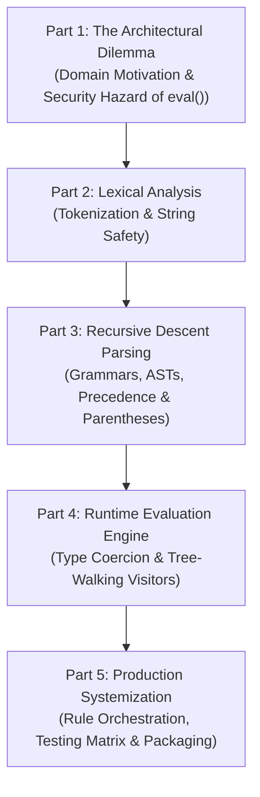

# Technical Article Series Blueprint: Building a Production-Grade Rule Engine from Scratch
**Project:** SimpleRuleEngine (`simple-rule-engine`)  
**Target Medium:** Medium / Dev.to / Substack / Personal Technical Blog / LinkedIn Articles  
**Target Audience:** Senior Python Engineers, Backend Architects, Systems Programmers, and AI/Rules Engineers  
**Series Theme:** *Compiler Engineering for Python Developers: Building a Zero-Dependency, Zero-Eval Rule Condition Parser and Expert System*

---

## 1. Publishing Sequence & Scope Rationale

### Why Exactly 5 Articles?
A common mistake in technical writing is either overloading an entire compiler project into a single 5,000-word monolith or fragmenting it into 12 micro-posts that lose narrative momentum. 

This 5-part architecture maps 1-to-1 with the discrete mental models and compiler engineering phases required to build a rule engine:

1. **Part 1** frames the engineering problem: decoupling business logic from code while avoiding the critical security vulnerabilities of `eval()`.
2. **Part 2** isolates lexical scanning, teaching developers how to turn raw strings into typed tokens without regular expression pitfalls.
3. **Part 3** tackles the core algorithmic leap: transitioning from brittle `str.split()` hacks to recursive descent AST generation.
4. **Part 4** covers runtime evaluation, dynamic type coercion, and short-circuit logic against dynamic facts dictionaries.
5. **Part 5** delivers end-to-end orchestration, an exhaustive test suite with `pytest`, and production packaging under PEP 621.

---

## 2. Comprehensive Article Breakdown

---

### Article 1: The Architecture of Rule Engines: Why Expert Systems Ditch Hardcoded If-Statements

#### Narrative Abstract
Hardcoding business conditions inside application code creates brittle, deployment-heavy architectures where every rule tweak requires a full CI/CD cycle. While developers often reach for Python's built-in `eval()` to execute dynamic rule strings, doing so introduces catastrophic Remote Code Execution (RCE) vulnerabilities. This article explores the architecture of declarative rule engines, defines the boundary between application state (facts) and business rules, and outlines the blueprint for building a safe, zero-dependency condition parser from first principles.

#### Repository Files & Components Covered
- `README.md` (Problem statement, requirements, and constraints)
- `src/rule.py` (Domain entity representation)
- `src/rule_engine.py` (Engine interface and rule firing concepts)
- `examples/all_examples.py` (Declarative vs. imperative code examples)

#### Key Technical Concepts & Engineering Principles
- **Imperative vs. Declarative Logic:** Moving from hardcoded branching (`if facts["marks"] >= 40`) to data-driven rule declarations.
- **The Security Hazards of `eval()`:** How `eval()` exposes internal namespace state, execution timeouts, and arbitrary code injection.
- **Expert System Architecture:** Working memory (Facts dictionary), Knowledge Base (Rules), and Inference Engine (Parser + Evaluator).
- **Domain-Specific Language (DSL) Boundaries:** Establishing grammar constraints for business rules.

#### Standalone Value Justification
Establishes the foundational "Why" and system context before writing a single line of parser code. It appeals to engineering leads and architects evaluating whether to adopt a rule engine versus embedding logic in Python code.

---

### Article 2: Building a Bulletproof Lexer: Tokenizing Rule Expressions without RegEx Vulnerabilities

#### Narrative Abstract
Before a rule string can be evaluated, it must be broken down into atomic, unambiguous tokens. Relying on basic string splitting or unchecked regular expressions fails when conditions contain quoted strings with spaces, multi-character operators, or negative numbers. In this article, we build an $O(N)$ single-pass lexical scanner in pure Python that converts raw condition strings into strongly-typed `Token` streams with exact character-offset tracking.

#### Repository Files & Components Covered
- `src/operators.py` (Comparison operators: `<=`, `>=`, `==`, `!=`, `<`, `>`)
- `src/logical_operators.py` (Logical operators: `AND`, `OR`)
- `src/parser.py:57-106` (Auditing current operator search bugs)
- `src/simple_rule_engine/tokens.py` (New `TokenType` and `Token` models)
- `src/simple_rule_engine/lexer.py` (Single-pass lexer implementation)

#### Key Technical Concepts & Engineering Principles
- **Lexical Scanning & Token Streams:** Converting raw character streams into semantic tokens (`IDENTIFIER`, `NUMBER`, `STRING`, `BOOLEAN`, `COMPARISON_OP`, `LOGICAL_OP`, `LPAREN`, `RPAREN`).
- **Greedy Operator Disambiguation:** Why multi-character operators (`>=`, `<=`, `==`, `!=`) must be matched before single-character operators (`>`, `<`) to prevent token truncation.
- **Quote-Handling & Escape Sequences:** Correctly scanning string literals like `'country == "United States"'` and handling internal quotes.
- **ReDoS Defense:** Avoiding catastrophic backtracking inherent in complex regular expressions by implementing a deterministic state-machine scanner.

#### Standalone Value Justification
Lexing is a distinct stage in compiler pipelines. By treating tokenization independently, this article shows how to eliminate the quote-stripping and operator-matching bugs discovered during the repository audit.

---

### Article 3: From Flat String Splitting to ASTs: Implementing a Recursive Descent Parser

#### Narrative Abstract
Naive string splitting (`condition.split("AND")`) breaks down when rules contain more than two clauses, nested parentheses, or mixed logical operators. To evaluate expressions like `(age >= 18 AND citizen == True) OR visa == True`, we need an Abstract Syntax Tree (AST). This article walks step-by-step through designing an EBNF grammar and implementing a Recursive Descent Parser that enforces operator precedence without third-party libraries.

#### Repository Files & Components Covered
- `src/parser.py:1-55` (Current flat single-clause parser audit)
- `src/logical_parser.py:1-53` (Current binary logical parser audit)
- `src/simple_rule_engine/ast_nodes.py` (`ASTNode`, `ComparisonNode`, `LogicalNode`, `LiteralNode`)
- `src/simple_rule_engine/parser.py` (Recursive descent parsing implementation)
- `docs/parser.md` (Formal grammar specification)

#### Key Technical Concepts & Engineering Principles
- **Extended Backus-Naur Form (EBNF):** Defining formal grammar rules for expressions, comparisons, and grouped sub-trees.
- **Abstract Syntax Trees (ASTs):** Representing hierarchical boolean and relational operations as composable object graphs.
- **Operator Precedence Climbing:** Ensuring parentheses `()` bind tighter than relational operators (`>=`), which bind tighter than `AND`, which binds tighter than `OR`.
- **Syntax Error Diagnostics:** Producing helpful error messages with character pointers when encountering unexpected tokens or unclosed parentheses.

#### Standalone Value Justification
This is the algorithmic centerpiece of the series. It demystifies recursive descent parsing for Python developers who might have assumed writing a parser requires Lex/Yacc or heavy external frameworks.

---

### Article 4: Safe Polymorphic Evaluation: Dynamic Type Coercion and Short-Circuit Tree Walking

#### Narrative Abstract
Once an AST is built, how do we evaluate it against arbitrary runtime facts? Fact dictionaries are dynamically typed, containing integers, floats, booleans, and strings. This article implements a tree-walking evaluator that traverses the AST, looks up runtime facts, coerces string literal tokens into matching Python datatypes, and executes short-circuit boolean evaluation while defending against `KeyError` and missing-variable edge cases.

#### Repository Files & Components Covered
- `src/evaluator.py:1-89` (Audit of type coercion, `convert_user_value`, and lookup mechanics)
- `src/simple_rule_engine/evaluator.py` (Visitor-pattern evaluator with short-circuit evaluation)
- `docs/evaluator.md` (Evaluator mechanics and type coercion contracts)

#### Key Technical Concepts & Engineering Principles
- **Tree-Walking Visitor Pattern:** Traversing AST nodes recursively to compute boolean outcomes.
- **Polymorphic Type Coercion:** Coercing AST token literals to match fact data types (`"40"` $\to$ `40` for integer facts, `"37.5"` $\to$ `37.5` for floats, `"True"` $\to$ `True` for booleans).
- **Short-Circuit Evaluation:** Preventing unnecessary sub-tree traversal (e.g. if the left branch of `AND` is `False`, skipping the right branch).
- **Missing-Fact Policies:** Handling undefined variables with configurable strict vs. lenient evaluation strategies.

#### Standalone Value Justification
Connects the compiler output (the AST) to the application runtime (facts), addressing real-world type casting, floating-point safety, and edge-case resilience.

---

### Article 5: From Parser to Expert System: Orchestration, Testing, and Production Packaging

#### Narrative Abstract
A robust parser is only as good as the system that wraps it. In this final installment, we assemble our lexer, parser, and evaluator into an industrial-strength `RuleEngine`. We build a rich `Rule` domain model, construct a 100% coverage parameterized `pytest` test suite covering every data type and edge case, and configure standard PEP 621 packaging (`pyproject.toml`) for distribution.

#### Repository Files & Components Covered
- `src/rule_engine.py` (Engine lifecycle and execution reporting)
- `src/rule.py` (Rich domain modeling)
- `tests/test_integer.py`, `tests/test_float.py`, `tests/test_string.py`, `tests/test_boolean.py`, `tests/test_operators.py`, `tests/test_invalid_conditions.py`
- `pyproject.toml` (Modern packaging configuration)
- `examples/*.py` (Production example suite)

#### Key Technical Concepts & Engineering Principles
- **Rule Orchestration & Conflict Resolution:** Evaluating sets of rules, collecting fired conclusions, and generating structured execution reports.
- **Parameterized Testing with `pytest`:** Constructing test matrices across comparison operators, data types, whitespace variations, and syntax errors.
- **Immutability & Encapsulation:** Replacing anemic data holders with immutable, self-validating domain models (`frozen=True`).
- **Modern Python Packaging:** Structuring packages with PEP 621 metadata, type hints (`py.typed`), and standalone CLI entrypoints.

#### Standalone Value Justification
Shows the full software development lifecycle—taking an algorithmic core and packaging it into a professional, test-backed, maintainable open-source library.

---

## 3. Article Distribution & Social Amplification Plan

| Part | Title | Primary Call-to-Action | Visual Asset Included |
| :---: | :--- | :--- | :--- |
| **1** | *The Architecture of Rule Engines: Why Expert Systems Ditch Hardcoded If-Statements* | Join discussion on `eval()` security risks in Python | System Architecture Block Diagram |
| **2** | *Building a Bulletproof Lexer: Tokenizing Rule Expressions without RegEx Vulnerabilities* | Clone starter repo & try the interactive Tokenizer | Finite State Machine / Token Stream Diagram |
| **3** | *From Flat String Splitting to ASTs: Implementing a Recursive Descent Parser* | Review the EBNF Grammar specification | AST Tree Diagram with Operator Precedence |
| **4** | *Safe Polymorphic Evaluation: Dynamic Type Coercion and Short-Circuit Tree Walking* | Try the live REPL evaluator script | Tree-Walking Visitor Flowchart |
| **5** | *From Parser to Expert System: Orchestration, Testing, and Production Packaging* | Star the GitHub repository & install via `pip` | Pytest Execution Matrix & Benchmark Summary |
